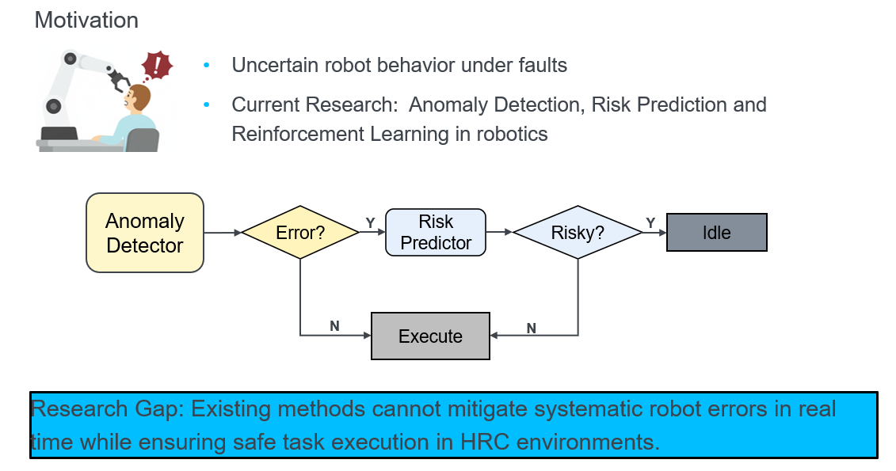
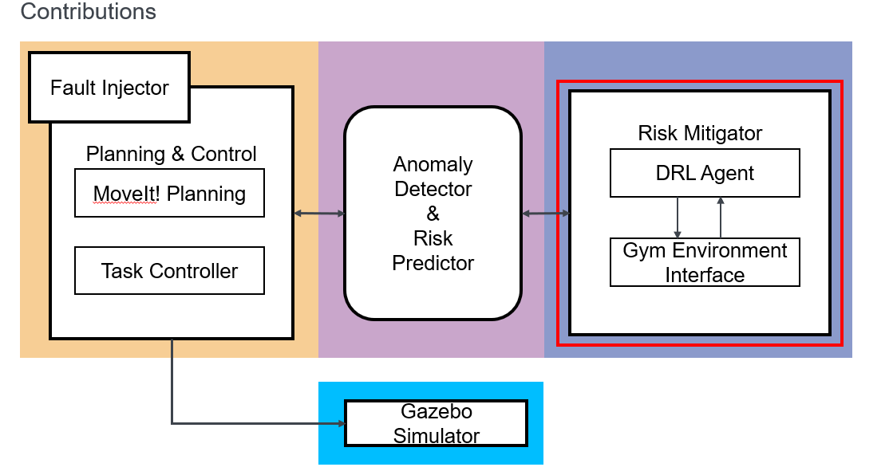
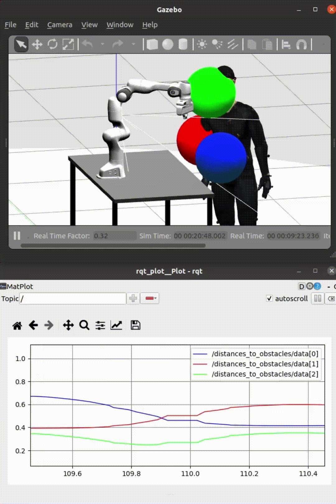

# RELAX: Reinforcement Learning-based Execution Mitigation in Human-Robot Collaboration

This repository contains the implementation of my master thesis at the University of Stuttgart:
**"Reinforcement Learning-based Execution Mitigation in Human-Robot Collaboration"** .

The framework integrates classical motion planning (MoveIt!) with deep reinforcement learning (DDPG, TD3, PPO) to correct joint-level faults of a Franka Emika Panda robot in real time, while keeping the human collaborator safe.

## Motivation

In modern human–robot collaboration (HRC), humans and robots share a workspace without physical barriers, which boosts productivity but introduces new safety risks. Standards such as ISO 10218 and ISO/TS 15066 mandate that the robot stops whenever a potential hazard is detected — a strategy that is safe but often overly conservative and inefficient. At the same time, as collaborative robots integrate more sensors, the system also becomes more vulnerable to sensor or actuator faults. When a joint sensor drifts or returns biased data, the planned motion silently becomes unsafe.

Existing work either (1) learns safe control policies assuming a healthy robot, or (2) detects anomalies but does not act on them. Neither addresses *real-time mitigation* — actively compensating for joint-level deviations after a fault has occurred — and the mitigation itself must remain safe for the nearby human.

## Contribution

This thesis develops a deep-reinforcement-learning-based execution mitigation framework for HRC. The main contributions are:

1. **Reproducible joint-bias fault injection** on the Franka Emika Panda via a dedicated ROS node, supporting controlled bias magnitudes (0.3 / 0.5 / 1.0 rad).
2. **Hybrid C++ / Python architecture** in which a C++ MoveIt! controller and a Python Stable-Baselines3 agent exchange faulty / corrected joint states through ROS topics, enabling real-time correction during motion.
3. **Learning-based correction policies** trained with DDPG, TD3, and PPO that adjust the joint state online, so MoveIt! can re-plan a safe trajectory from the corrected start to the original goal.
4. **Systematic evaluation** in both static and dynamic HRC environments, with fixed and randomized targets, showing large reductions in safety violations compared to the no-correction baseline.
5. **Algorithm comparison**: DDPG and TD3 converge fast and perform best in static tasks; PPO is more stable in dynamic environments where the human proxies move.

## Overview

- **Robot**: Franka Emika Panda (7-DoF)
- **Simulator**: Gazebo + MoveIt! (ROS Noetic)
- **RL library**: Stable-Baselines3 (PyTorch)
- **Algorithms**: DDPG, TD3, PPO
- **Task**: Pick-and-place with a virtual human in the shared workspace
- **Fault model**: Constant bias injected into joint 4 (`Δθ ∈ {0.3, 0.5, 1.0} rad`)

The agent is invoked in the critical Lift (State 4) and Transport (State 5) phases. Given the faulty joint state, it predicts a corrected joint configuration. MoveIt! then re-plans a trajectory from the corrected start to the original goal.

## Results

### Baseline (no correction)

Without RL correction, even a small joint bias causes frequent safety violations (end-effector entering the 0.2 m safety zone around the human proxies).

Baseline execution under injected joint bias:   

### Static environment (DDPG / TD3)

Both DDPG and TD3 converge within ~3000 timesteps and bring the failure rate down to ≤4% in the fixed-target case and ≤20% in the randomized-target case.

Execution in the static environment: 

### Dynamic environment (PPO)

In the dynamic environment, only PPO converges reliably. Failure rate is reduced from up to 86% (baseline) to ≤30% under all tested bias magnitudes, while the mean minimum distance stays above 0.2 m.

Execution in the dynamic environment: 

### Summary

| Scenario             | Algorithm | Failure rate | Mean min. distance |
|----------------------|-----------|----------------------------------|--------------------|
| Static / Fixed       | DDPG / TD3 | 0                         | > 0.22 m           |
| Static / Randomized  | DDPG / TD3 | 0                    | > 0.20 m           |
| Dynamic / Fixed      | PPO        | 14%                       | > 0.24 m           |
| Dynamic / Randomized | PPO        | 18%                       | > 0.23 m           |

