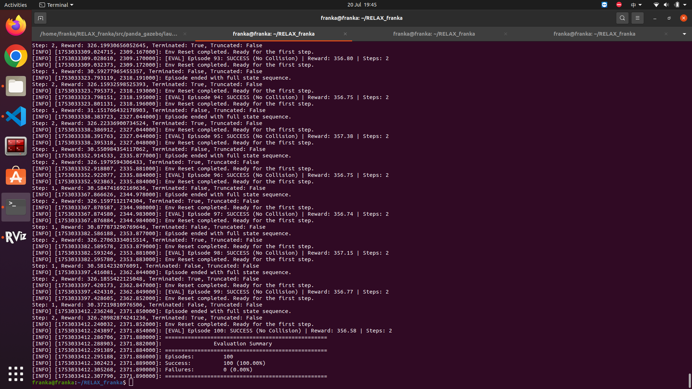

# 2025.7.18
## 1. Default Fault Injector 

**Fault injector**：state 4 or 5  
**Paramaters**：

fault_duration_min: 10
fault_duration_max: 10
fault_amplitude_min: 0.3
fault_amplitude_max: 0.3
joint_names:

panda_joint4

## 2. obstacles positions:
    self.obstacle1 = np.array([0.75, -0.25, 1.48])
    self.obstacle2 = np.array([0.75,  0.25, 1.48])
    self.obstacle3 = np.array([0.75, 0.0, 1.64])

## 3. RL Algorithms

### DDPG and TD3

- **Train**：999 episodes  

- **evaluation**：

20.08       Time     Planned J4      Actual J4       Error J4
------------------------------------------------------------
    0.0000        -1.6952        -1.9952         0.3000
    0.7750        -1.6952        -1.6882        -0.0070
    1.0717        -1.7386        -1.7296        -0.0090
    1.1983        -1.7821        -1.7703        -0.0118
    1.2965        -1.8256        -1.8140        -0.0116
    1.3803        -1.8690        -1.8475        -0.0215
    1.4539        -1.9125        -1.9054        -0.0071
    1.5205        -1.9560        -1.9496        -0.0063
    1.5885        -1.9995        -1.9945        -0.0050
    1.6628        -2.0429        -2.0357        -0.0072
    1.7465        -2.0864        -2.0725        -0.0139
    1.8447        -2.1299        -2.1204        -0.0094
    1.9723        -2.1733        -2.1701        -0.0032
    2.2689        -2.2168        -2.2169         0.0001
    2.5042        -2.2030        -2.2066         0.0036
    2.6129        -2.1892        -2.1956         0.0064
    2.6965        -2.1754        -2.1798         0.0044
    2.7679        -2.1616        -2.1674         0.0057
    2.8332        -2.1479        -2.1534         0.0056
    2.8984        -2.1341        -2.1388         0.0048
    2.9637        -2.1203        -2.1245         0.0042
    3.0289        -2.1065        -2.1100         0.0036
    3.0942        -2.0927        -2.0957         0.0030
    3.1595        -2.0789        -2.0811         0.0021
    3.2247        -2.0651        -2.0666         0.0015
    3.2900        -2.0513        -2.0522         0.0008
    3.3628        -2.0375        -2.0390         0.0014
    3.4490        -2.0238        -2.0278         0.0040
    3.5621        -2.0100        -2.0103         0.0004
    3.8274        -1.9962        -1.9958        -0.0003
控制rl去输出一个修正无效，还是会在规划最开始注入0.3的错误。只能转换为实时控制。